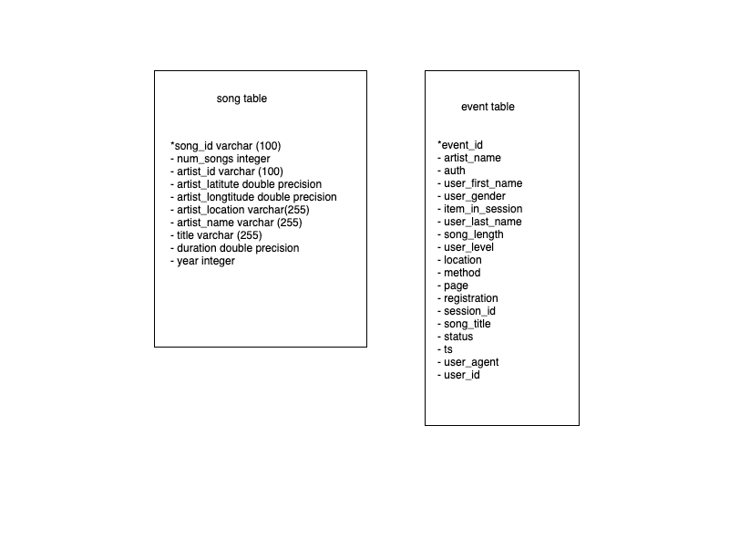
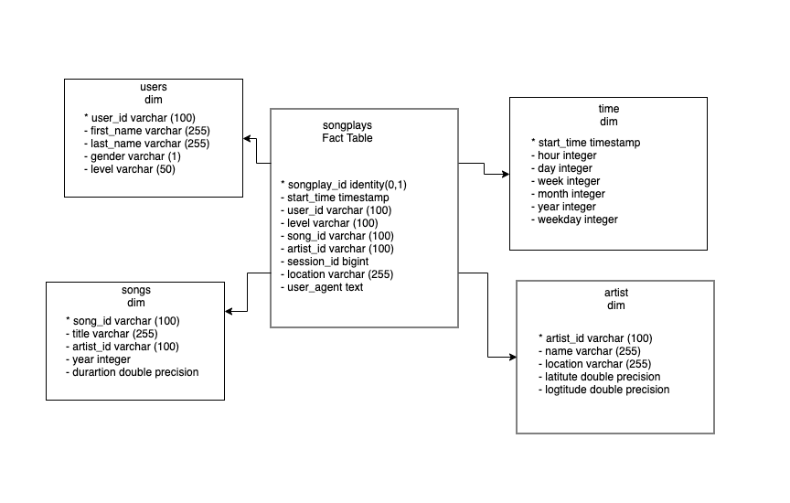

## Airflow Data Pipeline 
# Introduction 

A music streaming company, Sparkify, 
has decided that it is time to introduce 
more automation and monitoring to their 
data warehouse ETL pipelines and come to t
he conclusion that the best tool to achieve 
this is Apache Airflow.

They have decided to bring you into the 
project and expect you to create high 
grade data pipelines that are dynamic 
and built from reusable tasks, 
can be monitored, and allow easy backfills. 
They have also noted that the data quality plays 
a big part when analyses are executed on top the 
data warehouse and want to run tests against 
their datasets after the ETL steps have been 
executed to catch any discrepancies in the datasets.

The source data resides in S3 and needs to 
be processed in Sparkify's data warehouse 
in Amazon Redshift. 
The source datasets consist of JSON logs 
that tell about user activity in the application 
and JSON metadata about the songs the users listen to.

# Project Structure 
```
airflow-data-pipeline
│   README.md                    # Project description
│   docker-compose.yml           # Airflow containers description   
│   requirements.txt             # Python dependencies
|   dag.png                      # Pipeline DAG image
│   
└───airflow                      # Airflow home
|   |               
│   └───dags                     # Jupyter notebooks
│   |   │ s3_to_redshift_dag.py  # DAG definition
|   |   |
|   └───plugins
│       │  
|       └───helpers
|       |   | sql_queries.py     # All sql queries needed
|       |
|       └───operators
|       |   | data_quality.py    # DataQualityOperator
|       |   | load_dimension.py  # LoadDimensionOperator
|       |   | load_fact.py       # LoadFactOperator
|       |   | stage_redshift.py  # StageToRedshiftOperator
```
# Requiremrnts
-   Python3
-   Docker
-   Docker-compose (yml by [Bitnami](https://github.com/bitnami/bitnami-docker-airflow))
-   AWS account and Redshift cluster


## data stagging schema


## schema design 

